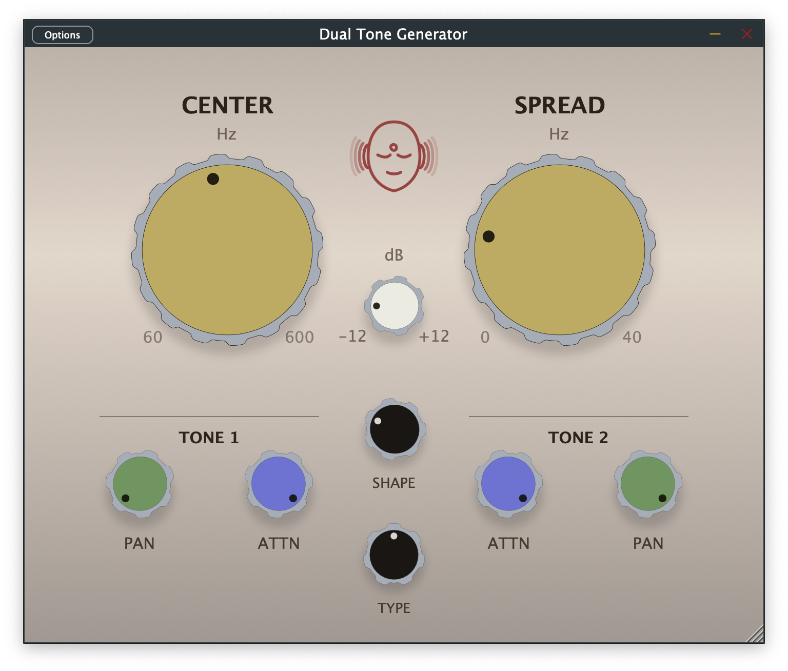

# Dual-Tone Generator

## Overview

This project builds a dual-tone audio generator as an AU component. The AU generates 2 sine waves simultaneously. The user can control:

- Center (Hz): The midpoint frequency shared by both oscillators (60-600 Hz).
- Spread (Hz): The symmetric offset from the center applied to both oscillators (0-20 Hz).
- Pan 1: The panning (L/R) of wave 1.
- Pan 2: The panning (L/R) of wave 2.
- Attn 1: The attenuation (dB) of wave 1.
- Attn 2: The attenuation (dB) of wave 2.
- Gain: Overall gain control (0-100 %).



Pan controls are only available if the AU is on a stereo bus (or higher # channels).

If on a mono bus, the pan controls are unavailable and the signals are summed to the mono channel.

If on a stereo bus, the pans are by default set so wave 1 is panned hard left and wave 2 is panned hard right.

The actual oscillator frequencies are derived from the two controls as:

- Frequency 1 = Center - Spread
- Frequency 2 = Center + Spread

With the default values (Center = 100 Hz, Spread = 2 Hz) the tones start at 98 Hz and 102 Hz respectively.

Attn 1 and Attn 2 should intially be set to 0 dB. Gain should intially be set to 80 %.

## Build Instructions

### Prerequisites
- CMake 3.15 or higher
- C++17 compatible compiler
- JUCE (fetched automatically or provided via `extern/JUCE`)

### Building the Plugin & Standalone App
1. Configure the project once (Debug is recommended while developing; switch to `Release` when packaging):
   ```bash
   cmake -S . -B build -DCMAKE_BUILD_TYPE=Debug
   ```

2. Build the desired target:
   - Standalone app:
     ```bash
     cmake --build build --target DualToneGenerator_Standalone
     # append "--config Debug" if you generated an Xcode/Visual Studio project
     ```
     The executable lives at `build/DualToneGenerator_artefacts/Debug/Standalone/DualToneGenerator`
     (or `Release/...` when configured that way).

   - Audio Unit plugin:
     ```bash
     cmake --build build --target DualToneGenerator_AU
     # append "--config Debug" when using multi-config generators
     ```
     The AU bundle is emitted to `build/DualToneGenerator_artefacts/Debug/AU/DualToneGenerator.component`
     (or the corresponding `Release` path).

### Installing the AU
Copy the generated AU component into the system plug-in folder and rescan in your host:
```bash
cp -R build/DualToneGenerator_artefacts/Release/AU/DualToneGenerator.component \
      ~/Library/Audio/Plug-Ins/Components/
```
Use the `Debug` path if you want to experiment with an unoptimized build locally.

### Running Tests
This project uses Catch2 for testing. To build and run the tests:

```bash
# Configure (if you have not already)
cmake -S . -B build -DCMAKE_BUILD_TYPE=Debug

# Build the test target
cmake --build build --target DualToneGeneratorTests
# add "--config Debug" for multi-config builds

# Run the tests (single-config path shown first)
./build/DualToneGeneratorTests
# or ./build/Debug/DualToneGeneratorTests for multi-config builds
```
